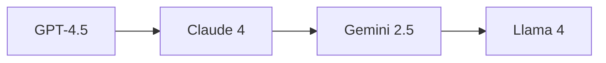
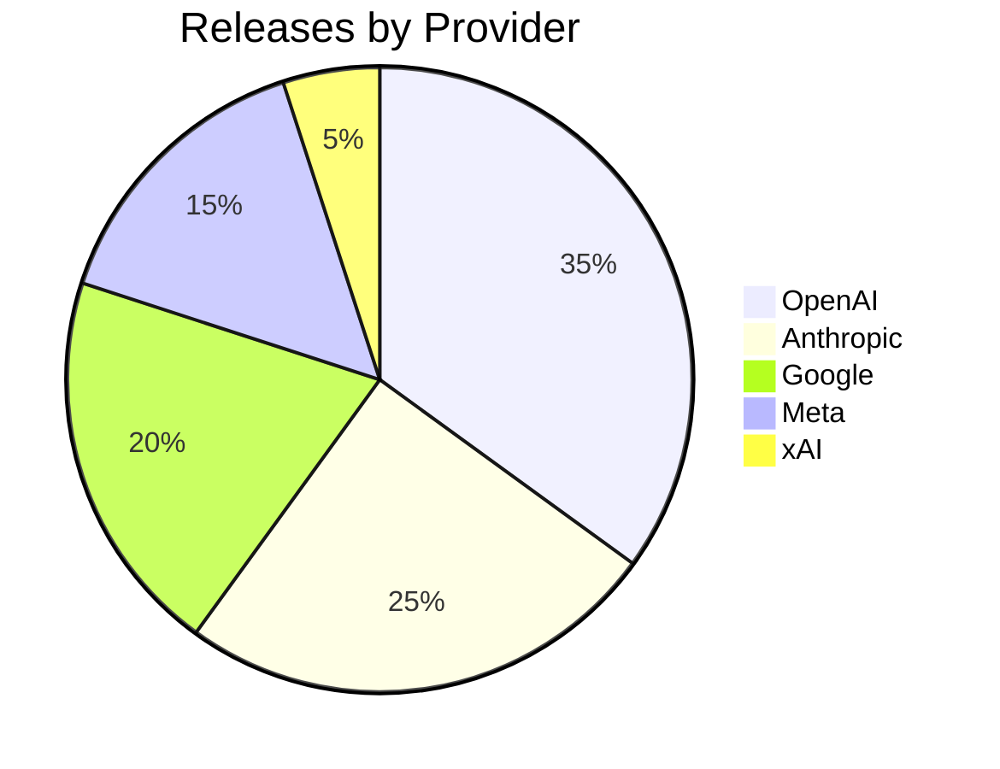

# Mermaid 차트 렌더링 지원 PRD 작성 프롬프트

---

## 사용법

아래 프롬프트를 LLM에 입력하여 PRD를 생성한다. `<api-spec>` 영역에 Agent API 설계서 전문을 삽입한다.

---

## 프롬프트

```
당신은 시니어 프론트엔드 엔지니어입니다. 아래 제공하는 Agent API 설계서의 요구사항과 기존 코드베이스 컨텍스트를 기반으로, Admin App의 Mermaid 차트 렌더링 기능에 대한 프론트엔드 PRD(Product Requirements Document)를 작성하세요.

# 역할
- 프론트엔드 데이터 시각화 전문가
- Mermaid.js 공식 문서(https://mermaid.js.org/intro/)에 정통
- react-markdown 공식 문서(https://github.com/remarkjs/react-markdown)에 정통
- 프론트엔드 보안(XSS 방지) 베스트 프랙티스에 정통
- 클린 코드 원칙과 업계 표준에 정통

# 입력 자료

<api-spec>
{여기에 docs/API-specifications/api-agent-specification.md 전문 삽입}
</api-spec>

# 배경

Agent API의 `AgentExecutionResult.summary` 필드는 LLM이 생성한 자연어 텍스트이며, Markdown 형식으로 다음을 포함할 수 있다:
- Markdown 표 (GFM)
- 코드 블록
- **Mermaid 차트** (flowchart, sequence diagram, pie chart 등)

현재 Admin App에서는 react-markdown + remark-gfm으로 일반 Markdown을 렌더링하고 있다. 이 PRD의 범위는 Mermaid 코드 블록(```mermaid)을 감지하여 시각적 차트로 렌더링하는 기능이다.

# 프로젝트 기본 정보

| 항목 | 내용 |
|------|------|
| 앱 이름 | Admin App |
| 앱 위치 | `/admin` |
| 기술 스택 | Next.js 16 (App Router) + React 19 + TypeScript |
| Markdown 렌더링 | react-markdown + remark-gfm (설치 완료) |
| Mermaid 라이브러리 | mermaid (npm 패키지, 아직 미설치) |
| 디자인 테마 | Neo-Brutalism |
| UI 언어 | 영문 |

# 기존 코드베이스 컨텍스트

## Markdown 렌더링 위치
Agent 페이지의 ASSISTANT 메시지 버블 내부에서 react-markdown을 사용하여 `summary`를 렌더링한다. Mermaid 렌더링은 이 react-markdown의 커스텀 코드 블록 컴포넌트로 통합되어야 한다.

## react-markdown 커스텀 컴포넌트 패턴

react-markdown은 `components` prop을 통해 특정 HTML 요소의 렌더링을 커스터마이징할 수 있다. Mermaid 차트는 코드 블록(`code` 컴포넌트)의 언어가 `mermaid`일 때 감지한다.

```tsx
// 기대하는 통합 패턴 (react-markdown 공식 문서 기반)
import ReactMarkdown from "react-markdown";
import remarkGfm from "remark-gfm";

<ReactMarkdown
  remarkPlugins={[remarkGfm]}
  components={{
    code({ className, children, ...props }) {
      const match = /language-(\w+)/.exec(className || "");
      if (match && match[1] === "mermaid") {
        return <MermaidBlock value={String(children).trim()} />;
      }
      // 일반 코드 블록 렌더링
      return <code className={className} {...props}>{children}</code>;
    },
  }}
>
  {summary}
</ReactMarkdown>
```

## Mermaid 입력 예시

Agent의 summary에 아래와 같은 Mermaid 코드 블록이 포함될 수 있다:

````markdown
## AI Model Release Analysis

Below is a timeline of recent releases:



### Release Distribution


````

## 디자인 시스템: Neo-Brutalism
- `.brutal-border`: border 2px solid #000000
- `.brutal-shadow-sm`: box-shadow 2px 2px 0px 0px #000000
- border-radius: 0 (직각)
- 색상: --primary (#3B82F6), --secondary (#F5F5F5), --foreground (#000000), --background (#FFFFFF)

# 기능 요구사항

## F1. Mermaid 코드 블록 감지 및 렌더링
- react-markdown의 `components.code`에서 언어가 `mermaid`인 코드 블록을 감지
- 감지된 Mermaid 코드를 mermaid.js로 SVG 차트로 렌더링
- 렌더링 실패 시 원본 코드 블록을 fallback으로 표시 (에러 메시지 포함)

## F2. MermaidBlock 컴포넌트
- Props: `value: string` (Mermaid 코드 텍스트)
- mermaid.render()를 호출하여 SVG 생성
- SVG를 안전하게 DOM에 삽입 (DOMPurify 또는 mermaid 내장 보안 사용)
- 렌더링 상태 관리: loading → rendered / error
- 각 MermaidBlock에 고유 ID 부여 (mermaid.render()에 필요)

## F3. 성능 최적화
- mermaid 라이브러리 lazy loading: `next/dynamic` 또는 동적 `import()`로 mermaid 포함 컴포넌트를 코드 분할
- mermaid.initialize()는 한 번만 호출 (모듈 레벨 초기화)
- 한 summary에 여러 Mermaid 블록이 있을 수 있으므로 순차 렌더링

## F4. 스타일링
- Mermaid SVG 컨테이너: brutal-border + 흰색 배경 + 내부 패딩
- SVG가 컨테이너 너비에 맞게 반응형 조정 (max-width: 100%, overflow-x: auto)
- Neo-Brutalism 테마와 조화: mermaid 테마를 `neutral` 또는 `base`로 설정
- 에러 fallback: 원본 코드 + "Failed to render chart" 경고 메시지

# 보안 요구사항

PRD에 아래 보안 사항을 반드시 명시하세요. **이 섹션은 Mermaid 렌더링에서 가장 중요한 부분이다.**

1. **XSS 방지 — mermaid 내장 보안**: mermaid.js는 v10+부터 내장 보안 기능(securityLevel: 'strict')을 기본 제공한다. `mermaid.initialize({ securityLevel: 'strict' })`를 반드시 설정하여 스크립트 삽입을 차단한다.
   - 공식 문서 참조: https://mermaid.js.org/config/usage.html#security-and-modify-diagrams
2. **SVG 삽입 방식**: mermaid.render()가 반환하는 SVG는 mermaid 내부에서 sanitize된 결과이다. `dangerouslySetInnerHTML` 사용이 불가피하나, `securityLevel: 'strict'` 설정이 전제 조건이다. 추가적으로 DOMPurify 적용을 권장한다.
3. **rehype-raw 금지**: react-markdown에 rehype-raw를 사용하지 않는다. Mermaid 블록만 별도 컴포넌트로 분리하여 처리한다.
4. **입력 출처**: Mermaid 코드는 LLM이 생성한 것이므로 신뢰할 수 없는 입력으로 간주한다. 모든 보안 조치를 적용한다.

# 출력 형식

아래 구조를 따라 PRD를 작성하세요:

## PRD 구조

1. **개요**: 기능 목적, 기술 스택, 의존 라이브러리
2. **아키텍처**: react-markdown + MermaidBlock 통합 구조. 컴포넌트 계층도. 데이터 흐름 (summary → react-markdown → code 컴포넌트 분기 → MermaidBlock → SVG)
3. **컴포넌트 상세**:
   - MermaidBlock: Props, 상태 관리, mermaid.render() 호출 로직, 에러 핸들링, 고유 ID 생성
   - react-markdown components.code 커스터마이징: mermaid 감지 로직
   - 에러 fallback UI
4. **보안 사항**: securityLevel 설정, SVG sanitization, XSS 방지 규칙
5. **성능 최적화**: lazy loading, 초기화, 코드 분할
6. **스타일링**: SVG 컨테이너 스타일, mermaid 테마 설정, 반응형 처리, Neo-Brutalism 일관성
7. **기술 구현 사항**: 설치할 패키지, 파일 구조 (components/agent/mermaid-block.tsx), mermaid.initialize() 설정값
8. **범위 제한**: 지원 차트 타입(flowchart, sequence, pie, gantt 등 mermaid 기본 지원 전체), 미포함 사항

# 제약 조건

- mermaid.js 공식 문서(https://mermaid.js.org/)에 명시된 API와 설정만 사용한다.
- react-markdown 공식 문서(https://github.com/remarkjs/react-markdown)에 명시된 components prop 패턴을 따른다.
- mermaid.initialize()에서 `securityLevel: 'strict'`를 반드시 설정한다.
- MermaidBlock은 클라이언트 컴포넌트('use client')로 구현한다. mermaid.js는 브라우저 DOM API에 의존하므로 SSR에서 실행할 수 없다.
- `next/dynamic`의 `ssr: false` 옵션으로 MermaidBlock을 동적 import하여 SSR을 건너뛴다.
- 기존 Neo-Brutalism 디자인 시스템과 시각적 일관성을 유지한다.
- 화면에 표시되는 모든 텍스트는 영문을 사용한다.
- 오버엔지니어링하지 않는다. Mermaid 에디터, 차트 내보내기(PNG/PDF), 인터랙티브 차트 조작, 커스텀 Mermaid 테마 설정 UI 등을 추가하지 않는다.
- 외부 자료는 반드시 공식 문서만 참고한다:
  - Mermaid.js: https://mermaid.js.org/
  - react-markdown: https://github.com/remarkjs/react-markdown
  - DOMPurify: https://github.com/cure53/DOMPurify (사용 시)
```

---

## 프롬프트 엔지니어링 기법 설명

| 기법 | 적용 위치 | 설명 |
|------|----------|------|
| Role Prompting | `# 역할` | 데이터 시각화 전문가 + Mermaid.js/react-markdown 공식 문서 전문가 역할 부여 |
| Authoritative Source Anchoring | `# 역할`, `# 제약 조건` | Mermaid.js, react-markdown, DOMPurify 공식 문서 URL을 명시적으로 제공하여 비공식 정보 참조 차단 |
| Integration Pattern Grounding | `## react-markdown 커스텀 컴포넌트 패턴` | 실제 통합 코드 스니펫을 제공하여 LLM이 정확한 API로 설계하도록 유도 |
| Concrete Input Examples | `## Mermaid 입력 예시` | Agent summary에 포함될 실제 Mermaid 코드 예시를 제공하여 설계 대상을 구체화 |
| Security-First Design | `# 보안 요구사항` | Mermaid 렌더링의 핵심 위험(XSS)을 별도 섹션으로 최우선 명시. securityLevel 설정, SVG sanitization, rehype-raw 금지를 구체적으로 지시 |
| Explicit Output Format | `## PRD 구조` | 8개 섹션 구조를 번호로 지정하여 누락 방지 |
| Enumerated Features | `# 기능 요구사항` F1~F4 | 4개 기능을 명확히 분리: 감지, 컴포넌트, 성능, 스타일링 |
| SSR Constraint | `# 제약 조건` | mermaid.js의 브라우저 DOM 의존성을 명시하여 SSR 관련 오류 설계를 사전 방지 |
| Negative Constraint | `# 제약 조건` | 에디터, 내보내기, 인터랙티브 조작 등 오버엔지니어링 항목을 명시적으로 배제 |
| Threat Modeling | `# 보안 요구사항` 4항 | "LLM 생성 코드는 신뢰할 수 없는 입력"으로 위협 모델을 명시하여 보안 설계의 근거 제공 |
| Design System Consistency | `## 디자인 시스템`, `# 제약 조건` | Neo-Brutalism 유틸리티 클래스 및 스타일 규칙을 명시하여 차트 컨테이너의 시각적 일관성 확보 |
